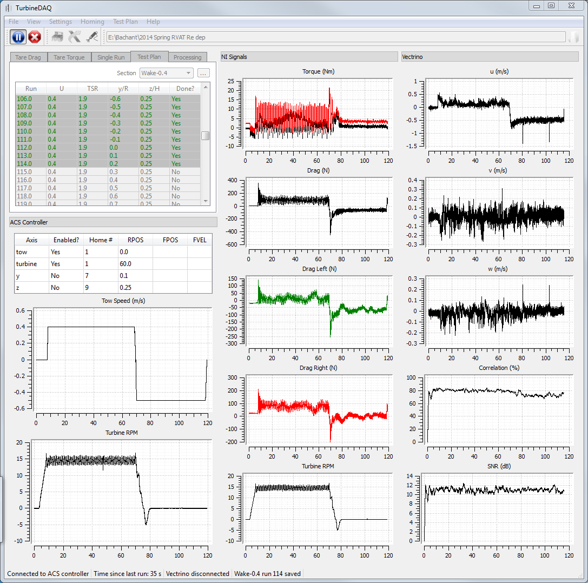

TurbineDAQ
==========
A Python desktop app for automated turbine data acquisition in the UNH tow tank. 

## Test plan
Currently, a test plan is created as an Excel spreadsheet either in the top level 
of the working directory or in a subdirectory named `Test plan`. Inside the test plan
there are sheets named `Top level`, `Perf-0.5`, `Tare drag`, etc., which correspond
to "sections" of the experiment, with the exception of `Top level`, which is an 
(optional)index of sections. 

The test plan, if one exists, is loaded into the GUI at startup. To change, it must be
edited externally and reloaded. 

## Directory and file structure
### Current 
Currently, raw data from a performance curve is saved in `Performance/U_0.5/1`, for 
an example tow at 0.5 m/s, with run index 1. Note that each run gets its own subdirectory.
This is influenced by the OpenFOAM directory structure. Metadata is currently saved for 
each run in JSON format, while raw data is saved in `*.mat` files. 

### Future

```
Test plan/
    Top level.csv
    Perf-0.8.csv
    Tare_drag.csv
Data/
    Perf-0.8/
        0/
            metadata.json
            data.h5
            vecdata.vno
	1/    
	    metadata.json
	    data.h5
            vecdata.vno
        processed.csv
    Tare_drag/
        0/
            metadata.json
	    data.h5
        processed.csv

```

Inside each HDF5 file (which will be saved via pandas), there will be a table for
each type of data--ACS, NI, and Vectrino.

## Types of runs
In the `runtypes` module, there are classes to represent each type of run:

  * `TurbineTow`
  * `TareDragRun`
  * `TareTorqueRun`

Each of these subclass PyQt's `QThread`. For future experiments, there will likely be
a `TurbineTowInWaves` or options in `TurbineTow` for wave generation with `makewaves`. 

Screenshot
----------



License
-------

TurbineDAQ Copyright (c) 2013-2014 Peter Bachant

This program is free software: you can redistribute it and/or modify
it under the terms of the GNU General Public License as published by
the Free Software Foundation, either version 3 of the License, or
(at your option) any later version.

This program is distributed in the hope that it will be useful,
but WITHOUT ANY WARRANTY; without even the implied warranty of
MERCHANTABILITY or FITNESS FOR A PARTICULAR PURPOSE.  See the
GNU General Public License for more details.

You should have received a copy of the GNU General Public License
along with this program.  If not, see <http://www.gnu.org/licenses/>.
